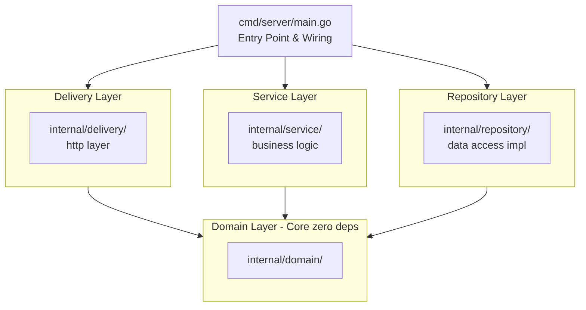

# KBank ECMS

## Description

This repository exposes the Rule Management API as a Go backend service structured following [golang-standards/project-layout](https://github.com/golang-standards/project-layout) with Clean Architecture principles.

- `POST /rule-management`: active API endpoint.

### Core Architectural Layers

The project is organized into four clean layers with a strict inward dependency rule — outer layers depend on inner layers, never the reverse.



#### Layer Responsibilities

| Layer              | Path                              | Responsibility                                               |
| ------------------ | --------------------------------- | ------------------------------------------------------------ |
| **Domain**         | `internal/domain/`                | Entities, repository interfaces. No external dependencies.   |
| **Use Case**       | `internal/usecase/`               | Business logic orchestration. Depends on domain only.        |
| **Repository**     | `internal/repository/`            | Redis & Azure implementations. Implements domain interfaces. |
| **Delivery**       | `internal/delivery/http/`         | Gin HTTP handlers, middleware, route definitions.            |
| **Infrastructure** | `internal/infrastructure/logger/` | Structured logging (cross-cutting concern).                  |
| **Pkg**            | `pkg/util/`                       | Generic public utilities safe for external use.              |

#### Project Structure

```text
├── cmd/
│   └── server/
│       └── main.go                          # Entry point — wires all layers
├── internal/
│   ├── domain/                              # Layer 1: Core entities & interfaces
│   ├── usecase/                             # Layer 2: Business logic
│   ├── repository/                          # Layer 3: Data access implementations
│   ├── delivery/                            # Layer 4: HTTP delivery
│   └── infrastructure/
│       └── logger/                          # Structured logging
├── pkg/
│   └── util/                                # Generic utilities
├── configs/                                 # YAML configuration files
├── docs/                                    # API docs & diagrams
└── dockerfile
```

## Installation

### Prerequisites

- [Go](https://golang.org/) 1.26+ (or your relevant Go version)
- [Docker](https://www.docker.com/) (Optional: for containerized deployment)
- [Redis](https://redis.io/)

### Build

This project utilizes a `Makefile` to simplify common build and development tasks. You can build the project for local testing or containerization using the following commands:

```bash
# Initialize workspace (install linters, swag, goose, and git hooks)
make init

# Local build (outputs binary to bin/server)
make build

# Build Docker Image (tags as kbank-ems:latest)
make dev-build
```

### Local Run

To set environment values and run the server locally, execute the following commands:

**Windows (PowerShell)**

```powershell
$env:SETENV="DEVLOCAL"
$env:REDIS_HOST="localhost"
$env:REDIS_PORT="6379"
go run ./cmd/server/
```

**Unix/macOS**

```bash
SETENV=DEVLOCAL REDIS_HOST=localhost REDIS_PORT=6379 go run ./cmd/server/
```

Upon successful execution, the service will start listening on `:8081`.

### Docker Compose

For the local container stack, start the services with Docker Compose:

```bash
docker compose up -d
```

Local endpoints:

- Rule Management API: `http://localhost:8081`
- CMS Delivery API: `http://localhost:8082`
- Swagger UI: `http://localhost:8083`
- RedisInsight: `http://localhost:5540`

RedisInsight is preconfigured to connect to the Compose Redis service as `local-redis`.

## Usage

You can test the active API endpoint by making an HTTP request. Below is an example using `curl`:

```bash
curl -X POST "http://localhost:8081/rule-management" \
  -H "requestID: req-002" \
  -H "Content-Type: application/json" \
  -d '{}'
```

### Configuration Files

Environment variables and configurations are read from properties in the `configs/` directory during startup:

- `configs/newservice_inbound_config.yaml` — Inbound rate limit & server settings
- `configs/newservice_outbound_config.yaml` — Outbound service settings
- `configs/redis_config.yaml` — Redis connection configurations

## Contributing

Pull requests are welcome. For major changes, please open an issue first to discuss what you would like to change.

Please make sure to update tests as appropriate.

## License

[MIT](https://choosealicense.com/licenses/mit/)
