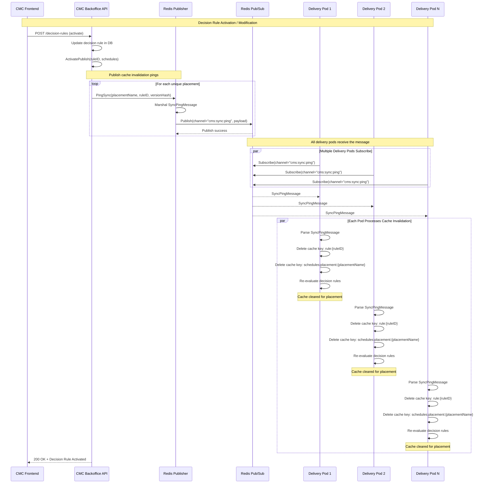

# KBank ECMS — CMS Delivery Runtime Service

A read-only personalization API that evaluates campaign content rules against user attributes and returns ranked content results. Built with Go and designed for high-throughput delivery workloads using a three-layer cache architecture.

### Cache Invalidation Flow (Redis Pub/Sub)

When a decision rule is activated or modified in the backoffice, the system uses Redis Pub/Sub to invalidate cached data across all delivery service pods. This ensures consistency without requiring a full cache flush.

**Cache Invalidation Sequence Diagram:**



---

## Key Features

- **Three-layer caching** — L1 in-memory mirror → L2 Redis → L3 PostgreSQL fallback
- **Real-time cache invalidation** via Redis Pub/Sub on the `cms:sync:ping` channel
- **Configurable background ticker** that periodically re-evaluates and warms caches (default 5 m)
- **Rule-based content personalization** evaluated fully in-process by `LocalEvaluator`
- **JWT authentication** and per-route rate limiting middleware
- **Prometheus metrics** at `/metrics`
- **Swagger UI** at `/swagger/index.html` with auto-generated docs via Swag
- **Google Wire** dependency injection — fully compile-time, no runtime reflection
- **Azure Key Vault / Managed Identity** support for production secret management
- **Docker-ready** multi-stage build targeting `alpine`

---

## Tech Stack

| Layer                | Technology                               |
| -------------------- | ---------------------------------------- |
| Language             | Go 1.26                                  |
| Web framework        | Gin                                      |
| ORM                  | GORM + PostgreSQL driver                 |
| Distributed cache    | Redis (go-redis v9)                      |
| Dependency injection | Google Wire                              |
| Observability        | Prometheus `client_golang`               |
| API documentation    | Swag                                     |
| Authentication       | `golang-jwt`                             |
| Cloud                | Azure SDK (Key Vault, Storage, Identity) |
| Testing              | testify, go-sqlmock, redismock, gofakeit |

---

## Prerequisites

- **Go 1.26+**
- **Docker** and **Docker Compose**
- Dev tooling installed by `make init`: `golangci-lint`, `swag`, `wire`
- External Docker network (required by the compose stack):

```bash
docker network create cmc-backend
```

---

## Installation

```bash
# 1. Clone the repository
git clone <repo-url>
cd KBank-ECMS-ContentStrategy

# 2. Copy and configure the environment file
cp .env.example .env
# Edit .env with your database and Redis credentials

# 3. Install dev tooling and git hooks
make init

# 4. Regenerate Wire dependency-injection code
make wire-gen

# 5. Start infrastructure (PostgreSQL + Redis)
make dev-up

# 6. Run the service
make run
```

The server listens on port **8082** by default.

---

## Configuration

All configuration is supplied through environment variables. Copy `.env.example` to `.env` and fill in the required values.

| Variable                         | Default                    | Description                                                                |
| -------------------------------- | -------------------------- | -------------------------------------------------------------------------- |
| `PORT`                           | `8082`                     | HTTP listen port                                                           |
| `SETENV`                         | `DEVLOCAL`                 | `DEVLOCAL` for local dev; unset in production / AKS                        |
| `DB_HOST`                        | `localhost`                | PostgreSQL host                                                            |
| `DB_PORT`                        | `5432`                     | PostgreSQL port                                                            |
| `DB_USER`                        | `postgres`                 | PostgreSQL user                                                            |
| `DB_PASSWORD`                    | _(required)_               | PostgreSQL password                                                        |
| `DB_NAME`                        | `kbank_ecms`               | PostgreSQL database name                                                   |
| `DB_SSLMODE`                     | `disable`                  | PostgreSQL SSL mode                                                        |
| `REDIS_HOST`                     | `localhost`                | Redis host                                                                 |
| `REDIS_PORT`                     | `6379`                     | Redis port                                                                 |
| `REDIS_PASSWORD`                 | _(empty)_                  | Redis password                                                             |
| `REDIS_PRINCIPAL_ID`             | _(empty)_                  | Azure Managed Identity principal ID for Redis Entra auth (production only) |
| `CMS_RUNTIME_TTL`                | `15m`                      | Redis / memory cache TTL                                                   |
| `CMS_RUNTIME_INTERVAL`           | `5m`                       | Background ticker interval                                                 |
| `SWAGGER_HOST`                   | `localhost:8082`           | Host shown in Swagger UI                                                   |
| `PREFIX_CONTENT_STRATEGY_API_V1` | `/api/content-strategy/v1` | API route prefix                                                           |
| `AZACCOUNTNAME`                  | _(empty)_                  | Azure Storage account name (optional)                                      |
| `SHARENAME`                      | _(empty)_                  | Azure Files share name (optional)                                          |

---

## Usage

### API Endpoints

| Method | Endpoint                                        | Description                                               |
| ------ | ----------------------------------------------- | --------------------------------------------------------- |
| `GET`  | `/api/content-strategy/v1/personalized-content` | Returns ranked personalized content for a user            |
| `GET`  | `/api/content-strategy/v1/purge_requests`       | Returns current cache status                              |
| `GET`  | `/api/content-strategy/v1/purge_requests/value` | Inspects a specific cache entry by key                    |
| `POST` | `/api/content-strategy/v1/purge_requests`       | Flushes the cache                                         |
| `GET`  | `/healthz`                                      | Health check — verifies PostgreSQL and Redis connectivity |
| `GET`  | `/metrics`                                      | Prometheus metrics                                        |
| `GET`  | `/swagger/*any`                                 | Swagger UI                                                |

### Example request

```bash
curl -H "X-User-Id: <user-id>" \
     "http://localhost:8082/api/content-strategy/v1/personalized-content"
```

---

## Development Commands

| Command          | Description                                                     |
| ---------------- | --------------------------------------------------------------- |
| `make init`      | Install tooling (`golangci-lint`, `swag`, `wire`) and git hooks |
| `make build`     | Build binary and regenerate Swagger docs                        |
| `make run`       | Run the service locally                                         |
| `make wire-gen`  | Regenerate Wire DI code after changing providers                |
| `make swagger`   | Regenerate Swagger API docs                                     |
| `make fmt`       | Format code (gofmt + custom GORM / JSON tag formatter)          |
| `make lint`      | Run `golangci-lint`                                             |
| `make vet`       | Run `go vet`                                                    |
| `make test`      | Run all tests                                                   |
| `make dev-up`    | Start infrastructure (PostgreSQL + Redis via Docker Compose)    |
| `make dev-down`  | Stop infrastructure                                             |
| `make dev-build` | Build Docker image                                              |
| `make clean`     | Remove build artifacts                                          |

---

## Testing

```bash
# Run all tests
go test ./...

# Run with race detector
go test -race ./...

# Run a specific test suite
go test ./cmd/server/service/... -run TestCMSDeliveryService
```

---

## Architecture

### Request Flow

```
GET /api/content-strategy/v1/personalized-content
  │
  ├── Gin router
  │     internal/delivery/http/router.go
  │
  ├── Middleware stack
  │     auth · rate-limit · timeout · CORS · Prometheus
  │
  ├── Handler
  │     cmd/server/handler/handler.go
  │
  ├── CMSDeliveryService.GetPersonalizedContent()
  │     cmd/server/service/
  │
  ├── Cache lookup
  │     L1 MemoryCache → L2 Redis → L3 PostgreSQL (fallback)
  │
  └── LocalEvaluator.Evaluate()
        cmd/server/internal/evaluator/
        └── []dto.ContentResult
```

### Background Operations

| Process              | Description                                                                                                            |
| -------------------- | ---------------------------------------------------------------------------------------------------------------------- |
| `runLoop`            | Fires `evaluate()` on every `CMS_RUNTIME_INTERVAL` tick to warm caches                                                 |
| `subscribeToUpdates` | Listens on `cms:sync:ping`; applies 50–500 ms jitter to prevent stampede; performs targeted or full cache invalidation |

### Project Structure

```
├── cmd/server/
│   ├── main.go               Entry point
│   ├── wire.go               DI graph (source of truth)
│   ├── wire_gen.go           Auto-generated — do not edit
│   ├── providers.go          Wire constructor functions
│   ├── handler/              Gin handlers and route registration
│   └── service/              CMSDeliveryService (core evaluation + caching)
├── internal/
│   ├── delivery/http/        Middleware, DTOs, router, health check
│   ├── domain/               GORM entity models and repository interfaces
│   ├── infrastructure/       In-memory cache, database, logger, Pub/Sub
│   └── repository/           PostgreSQL and Redis repository implementations
├── pkg/
│   ├── auth/                 JWT helpers
│   └── config/               AppConfig loader
└── configs/                  YAML configuration files
```

### Dependency Injection

Wire is used for compile-time DI. Edit `cmd/server/wire.go` or `cmd/server/providers.go`, then regenerate:

```bash
make wire-gen
```

> `cmd/server/wire_gen.go` is auto-generated. Do not edit it manually.

---

## Docker

```bash
# Build the image
make dev-build

# Start the full stack (service + Postgres + Redis)
docker compose up -d

# Stop the stack
make dev-down
```

The compose stack requires the `cmc-backend` external network. Create it once:

```bash
docker network create cmc-backend
```

---

## License

This project is licensed under the [MIT License](LICENSE).
